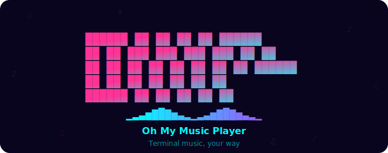
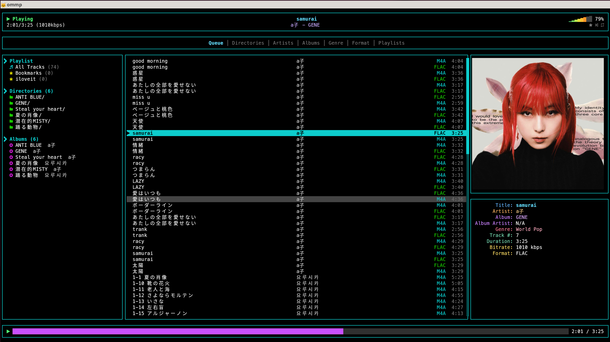

<p align="center">
  
</p>

<p align="center">
  <a href="https://github.com/devastator-x/ommp"></a>
  <a href="https://github.com/devastator-x/ommp"></a>
</p>

<p align="center">
  A standalone terminal music player built with Rust.<br>
  No MPD, no daemon — just run <code>ommp</code> and play.
</p>

<p align="center">
  
</p>

---

## Features

- **Music playback** — FLAC, MP3, M4A, OGG, WAV, Opus, AAC, WMA
- **Browse your library** — by artist, album, genre, format, directory, or playlist
- **Album art** — displayed natively in supported terminals
- **Search** — find any track instantly with filters like `artist:`, `album:`, `genre:`, `*.flac`
- **Playlists** — create, rename, delete, and bookmark your favorite tracks
- **Mouse friendly** — click, scroll, drag to resize panes
- **Remembers your settings** — volume, playlists, layout are saved between sessions
- **Live sync** — automatically picks up new or removed files in your music folder

## Before You Start

### Nerd Font (required)

OMMP uses [Nerd Font](https://www.nerdfonts.com/) icons throughout the interface. Without one installed, icons will appear as broken squares.

Recommended fonts: **JetBrainsMono Nerd Font**, **MesloLGS NF**, **FiraCode Nerd Font**

After installing, set it as your terminal's font.

### Terminal (recommended: Kitty)

OMMP works in any terminal with true color (24-bit) support, but **[Kitty](https://sw.kovidgoyal.net/kitty/)** is recommended for the best experience — album art is displayed at full quality using Kitty's native image protocol.

Other terminals with Sixel support (foot, WezTerm) also display album art well. Standard terminals fall back to block-character rendering.

### Audio

PulseAudio or ALSA is required for audio output on Linux.

## Install

Make sure you have [Rust](https://rustup.rs/) installed, then run:

```bash
cargo install --git https://github.com/devastator-x/ommp
```

That's it. Now you can run `ommp` from anywhere:

```bash
ommp
```

<details>
<summary><code>ommp: command not found</code>?</summary>

`~/.cargo/bin`이 PATH에 등록되어 있지 않을 수 있습니다. 아래 줄을 `~/.bashrc` 또는 `~/.zshrc`에 추가하세요:

```bash
export PATH="$HOME/.cargo/bin:$PATH"
```

터미널을 재시작하면 적용됩니다.

</details>

<details>
<summary>소스에서 직접 빌드하기</summary>

```bash
git clone https://github.com/devastator-x/ommp.git
cd ommp
cargo build --release
./target/release/ommp
```

</details>

## Usage

`~/Music` 폴더에 음악 파일을 넣고 `ommp`를 실행하면 자동으로 라이브러리를 스캔합니다. 하위 폴더도 모두 탐색합니다.

앨범 아트는 음악 파일과 같은 폴더에 `cover.jpg`, `folder.jpg`, `front.jpg` 등의 이름으로 넣어두면 자동으로 인식됩니다.

### Browsing

화면은 3개의 패널로 나뉩니다:

- **왼쪽** — 라이브러리 탐색 (탭에 따라 아티스트, 앨범, 장르 등)
- **가운데** — 재생 대기열 (Queue)
- **오른쪽** — 앨범 아트 / 시계 (위) + 가사 (아래)

상단 탭으로 탐색 모드를 전환합니다: Queue, Directories, Artists, Albums, Genre, Format, Playlists

### Search

`Ctrl+E, s`로 검색 창을 열 수 있습니다. 입력하는 즉시 결과가 필터링됩니다.

특정 필드로 검색하려면:

- `artist:radiohead` — 아티스트명으로 검색
- `album:ok computer` — 앨범명으로 검색
- `genre:rock` — 장르로 검색
- `*.flac` — 파일 포맷으로 필터

## Keybindings

앱 안에서 `Ctrl+E, h`를 누르면 전체 단축키 목록을 볼 수 있습니다.

### Playback

| Key | Action |
|-----|--------|
| `Space` | 재생 / 일시정지 |
| `n` / `N` | 다음 곡 / 이전 곡 |
| `+` / `-` | 볼륨 올리기 / 내리기 |
| `Left` / `Right` | 5초 뒤로 / 앞으로 |
| `s` | 셔플 토글 |
| `r` | 반복 모드 전환 (끄기 / 전체 / 한곡) |

### Navigation

| Key | Action |
|-----|--------|
| `j` / `k` | 아래 / 위 이동 |
| `h` / `l` | 이전 / 다음 패널로 이동 |
| `Tab` / `Shift+Tab` | 패널 순환 |
| `1`–`7` | 탭 전환 |
| `Enter` | 선택한 항목 재생 |
| `g` / `G` | 목록 맨 위 / 맨 아래로 |
| `d` | 대기열에서 제거 |
| `b` | 플레이리스트에 추가 |
| `p` | 정보 패널 전환 (시계 / 앨범아트) |
| `q` | 종료 |

### Chord commands (`Ctrl+E` 후 키 입력)

| Key | Action |
|-----|--------|
| `Ctrl+E, s` | 검색 |
| `Ctrl+E, h` | 도움말 |
| `Ctrl+E, r` | 패널 크기 조절 모드 |
| `Ctrl+E, i` | OMMP 정보 |
| `Ctrl+E, l` | 라이브러리 다시 스캔 |

### Mouse

| Action | Effect |
|--------|--------|
| 탭 클릭 | 탭 전환 |
| 패널 클릭 | 패널 포커스 + 항목 선택 |
| 트랙 더블클릭 | 즉시 재생 |
| 패널 경계 드래그 | 패널 크기 조절 |
| 프로그레스 바 클릭 | 해당 위치로 이동 |
| 스크롤 | 목록 스크롤 |

## License

[MIT](LICENSE)
