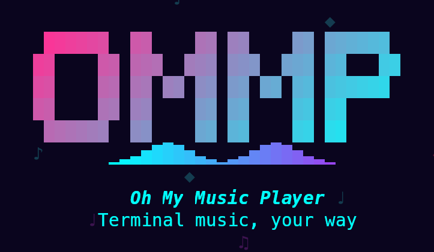

<p align="center">
  
</p>

<p align="center">
  <a href="https://github.com/devastator-x/ommp"></a>
  <a href="https://github.com/devastator-x/ommp"></a>
</p>

<p align="center">
  A standalone terminal music player built with Rust.<br>
  No MPD, no daemon — just run <code>ommp</code> and play.
</p>

<p align="center">
  
</p>

---

## Features

- **Music playback** — FLAC, MP3, M4A, OGG, WAV, Opus, AAC, WMA
- **Browse your library** — by artist, album, genre, format, directory, or playlist
- **Album art** — displayed natively in supported terminals
- **Search** — find any track instantly with filters like `artist:`, `album:`, `genre:`, `*.flac`
- **Playlists** — create, rename, delete, and bookmark your favorite tracks
- **Mouse friendly** — click, scroll, drag to resize panes
- **Remembers your settings** — volume, playlists, layout are saved between sessions
- **Live sync** — automatically picks up new or removed files in your music folder

## Before You Start

### Nerd Font (required)

OMMP uses [Nerd Font](https://www.nerdfonts.com/) icons throughout the interface. Without one installed, icons will appear as broken squares.

Recommended fonts: **JetBrainsMono Nerd Font**, **MesloLGS NF**, **FiraCode Nerd Font**

After installing, set it as your terminal's font.

### Terminal (recommended: Kitty)

OMMP works in any terminal with true color (24-bit) support, but **[Kitty](https://sw.kovidgoyal.net/kitty/)** is recommended for the best experience — album art is displayed at full quality using Kitty's native image protocol.

Other terminals with Sixel support (foot, WezTerm) also display album art well. Standard terminals fall back to block-character rendering.

### Audio

PulseAudio or ALSA is required for audio output on Linux.

## Install

Make sure you have [Rust](https://rustup.rs/) installed, then run:

```bash
cargo install --git https://github.com/devastator-x/ommp
```

That's it. Now you can run `ommp` from anywhere:

```bash
ommp
```

<details>
<summary><code>ommp: command not found</code>?</summary>

`~/.cargo/bin` may not be in your PATH. Add this line to your `~/.bashrc` or `~/.zshrc`:

```bash
export PATH="$HOME/.cargo/bin:$PATH"
```

Restart your terminal to apply.

</details>

<details>
<summary>Build from source</summary>

```bash
git clone https://github.com/devastator-x/ommp.git
cd ommp
cargo build --release
./target/release/ommp
```

</details>

## Usage

Place your music files in `~/Music` and run `ommp`. It will automatically scan all files and subdirectories.

Album art is detected automatically — just place `cover.jpg`, `folder.jpg`, `front.jpg`, or any image file in the same directory as your tracks.

### Browsing

The screen is split into three panels:

- **Left** — Library browser (artists, albums, genres, etc. depending on the active tab)
- **Center** — Play queue
- **Right** — Album art / Clock (top) + Lyrics (bottom)

Switch browsing modes using the tabs at the top: Queue, Directories, Artists, Albums, Genre, Format, Playlists

### Search

Press `Ctrl+E, s` to open the search modal. Results filter as you type.

You can also search by specific fields:

- `artist:radiohead` — search by artist
- `album:ok computer` — search by album
- `genre:rock` — search by genre
- `*.flac` — filter by format

## Keybindings

Press `Ctrl+E, h` inside the app to view the full keybinding list at any time.

### Playback

| Key | Action |
|-----|--------|
| `Space` | Play / Pause |
| `n` / `N` | Next / Previous track |
| `+` / `-` | Volume up / down |
| `Left` / `Right` | Seek backward / forward 5s |
| `s` | Toggle shuffle |
| `r` | Cycle repeat (off / all / one) |

### Navigation

| Key | Action |
|-----|--------|
| `j` / `k` | Move down / up |
| `h` / `l` | Focus previous / next panel |
| `Tab` / `Shift+Tab` | Cycle panel focus |
| `1`–`7` | Switch tab |
| `Enter` | Play selected item |
| `g` / `G` | Jump to top / bottom |
| `d` | Remove from queue |
| `b` | Add to playlist |
| `p` | Toggle info panel (Clock / Album Art) |
| `q` | Quit |

### Chord commands (press `Ctrl+E`, then a key)

| Key | Action |
|-----|--------|
| `Ctrl+E, s` | Search |
| `Ctrl+E, h` | Help |
| `Ctrl+E, r` | Panel resize mode |
| `Ctrl+E, i` | About OMMP |
| `Ctrl+E, l` | Rescan library |

### Mouse

| Action | Effect |
|--------|--------|
| Click tab | Switch tab |
| Click panel | Focus panel + select item |
| Double-click track | Play immediately |
| Drag panel border | Resize panels |
| Click progress bar | Seek to position |
| Scroll wheel | Scroll lists |

## License

[MIT](LICENSE)
